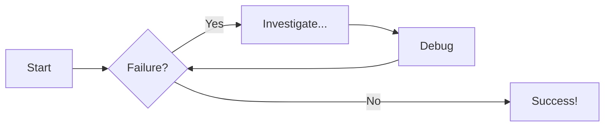
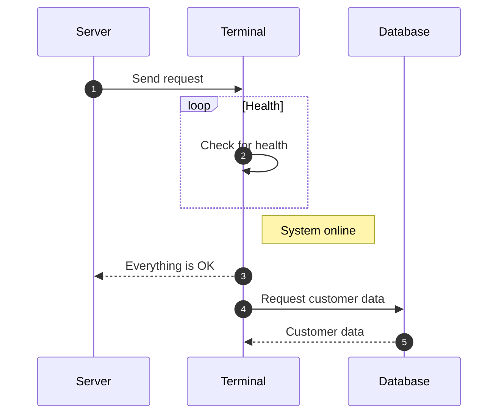

# Welcome to MkDocs

For full documentation visit [mkdocs.org](https://www.mkdocs.org).

## Commands

* `mkdocs new [dir-name]` - Create a new project.
* `mkdocs serve` - Start the live-reloading docs server.
* `mkdocs build` - Build the documentation site.
* `mkdocs -h` - Print help message and exit.

## Project layout

    mkdocs.yml    # The configuration file.
    docs/
        index.md  # The documentation homepage.
        ...       # Other markdown pages, images and other files.

I like to drink :beer: after i palyer :soccer:

An Example code of code block

```js title="code-examples.md" linenums="1" hl_lines="2-4"
// Function to concatenate two strings
function concatenateStrings(str1, str2) {
  return str1 + str2;
}

// Example usage
const result = concatenateStrings("Hello, ", "World!");
console.log("The concatenated string is:", result);
```

## Content Tabs

This is some examples of content tabs.

### Generic Content

=== "Plain text"

    This is some plain text

=== "Unordered list"

    * First item
    * Second item
    * Third item

=== "Ordered list"

    1. First item
    2. Second item
    3. Third item


### Code Blocks in Content Tabs

=== "Python"

    ```py
    def main():
        print("Hello world!")

    if __name__ == "__main__":
        main()
    ```

=== "JavaScript"

    ```js
    function main() {
        console.log("Hello world!");
    }

    main();
    ```

## Types of text boxes

!!! note "Title of the callout"

    Lorem ipsum dolor sit amet, consectetur adipiscing elit. Nulla et euismod
    nulla. Curabitur feugiat, tortor non consequat finibus, justo purus auctor
    massa, nec semper lorem quam in massa.

??? info "Title of the callout"

    Lorem ipsum dolor sit amet, consectetur adipiscing elit. Nulla et euismod
    nulla. Curabitur feugiat, tortor non consequat finibus, justo purus auctor
    massa, nec semper lorem quam in massa.


# Diagram Examples

## Flowcharts




## Sequence Diagrams

