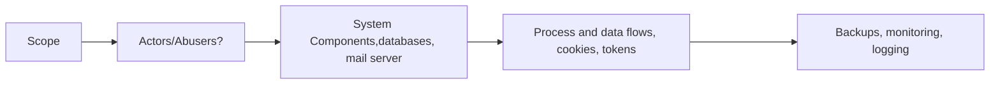
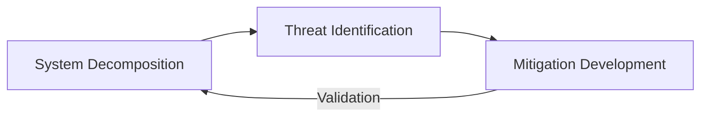
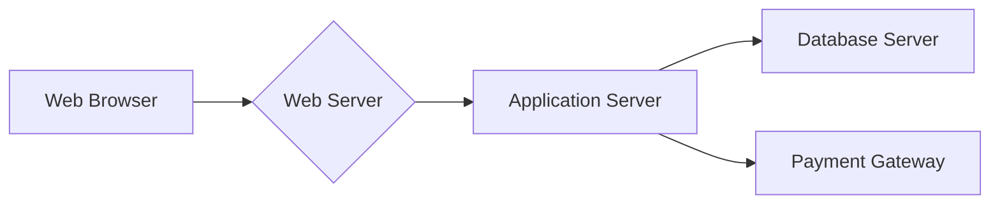

# Threat Modelling 

Threat Modeling is a structured process for identifying, analyzing, and mitigating potential threats to system and data. It's proctive approach that helps organizations understand vulnerabilities and prioritize security efforts to prevent attacks before they happen. [Guide](\assets\AdvancedThreatModelingMethodologiesImplementation.pdf)



### Core Principles of Effective Threat Modeling
- Regardless of methodology, effective threat modeling adheres to several fundamental principles.
    - **Systematic Approach**: Following a structured process rather then ad-hoc security reviews.
    - **Attacker Perspective**: Examining systems from an adversarial viewpoint.
    - **Risk-Based Prioritization**: Focusing efforts on the most significant threats.
    - **Early Integration**: Applying threat modeling during design rather then after implementation.
    - **Continous Refinement**: Updating models as systems and threats evolve.
    
### Threat Modeling Process Framework



1. System Decomposition: Creating a comprehensive model of the system architecture, data flows, trust boundaries, and assets
2. Threat Identification: Systematically identifying potential threats using structured methodologies
3. Mitigation Development: Designing controls and countermeasures to address identified threats
4. Validation: Verifying that mitigations effectively address the identified threats

### Advanced Threat Modeling Methodologies
#### STRIDE Methodology Deep Dive
- Microsoft's STRIDE framework remains one of the most widely adopted threat modeling approaches, providing a mnemonic for six threat categories:

| Threat Type          | Definition                                 | Example Attack Vectors                                           | Typical Security Properties |
|----------------------|---------------------------------------------|------------------------------------------------------------------|-----------------------------|
| Spoofing             | Impersonating something or someone else     | Session hijacking, phishing, IP spoofing                         | Authentication              |
| Tampering            | Modifying data or code                      | Parameter tampering, SQL injection, binary manipulation          | Integrity                   |
| Repudiation          | Claiming to not have performed an action    | Disabling audit logs, log forgery, timestamp manipulation        | Non-repudiation             |
| Information Disclosure | Exposing information to unauthorized individuals | Path traversal, CSRF, unintended data leakage              | Confidentiality             |
| Denial of Service    | Degrading or blocking access to services    | Resource exhaustion, flooding attacks, deadlocks                 | Availability                |
| Elevation of Privilege | Gaining higher privileges than intended   | Vertical/horizontal privilege escalation, buffer overflows        | Authorization               |

#### DREAD Risk Assessment Model
- DREAD provides a quantitative risk assessment framework by evaluating:
    - Damage Potential: How severe is the damage if the vulnerability is exploited?
    - Reproducibility: How easy is it to reproduce the attack?
    - Exploitability: How much effort and expertise is needed to exploit the vulnerability?
    - Affected Users: How many users would be affected by the exploit?
    - Discoverability: How easy is it to discover the vulnerability?

- Each factor is typically rated on a scale of 1-10, and the final risk score is calculated as:

```yaml
Risk Score = (D + R + E + A + D) / 5
```


### System Decomposition Techniques
#### Data Flow Diagrams (DFDs) for Threat Modeling
Data Flow Diagrams provide a visual representation of how information moves through a system:



- For threat modeling, standard DFDs are enhanced with:
    - Trust Boundaries: Lines or containers indicating where trust levels change
    - Data Classifications: Indicators of the sensitivity level of data in each flow
    - Authentication Points: Markers for where authentication occurs

#### Trust Boundary Identification and Analysis
- Trust boundaries represent the points where data or control flow crosses between different trust levels. Key trust boundaries include:
    - Process Boundaries: Between different software processes
    - Network Boundaries: Between network segments (e.g., internet to DMZ)
    - Physical Boundaries: Between physical locations
    - Trust Level Boundaries: Between security contexts (e.g., authenticated vs. unauthenticated)

###### Attack Tree
- Attack trees are a visual representation of a potential attack scenario. The tree has a root (the goal of the attack) and branches (the steps to achieve the goal). By breaking down an attack into smaller steps, organizations can better understand the attacker’s motivations and identify vulnerabilities in their defenses. The attack tree can be used to prioritize risks and identify potential security controls to mitigate them.

```yaml
Root Goal: Obtain Administrative Access to Financial Database
|
├── Attack Vector 1: SQL Injection
│ ├── Discover vulnerable parameter (AND)
│ ├── Craft malicious payload (AND)
│ ├── Execute injection attack (AND)
│ ├── Escalate to system commands (AND)
│ └── Create backdoor account
│
├── Attack Vector 2: Credential Theft
│ ├── Target Database Administrator
│ │ ├── Phishing attack (OR)
│ │ ├── Malware deployment (OR)
│ │ └── Social engineering
│ └── Use stolen credentials
│
└── Attack Vector 3: Exploit Unpatched Vulnerability
    ├── Identify database version (AND)
    ├── Research known vulnerabilities (AND)
    ├── Develop/acquire exploit (AND)
    └── Execute exploit
```